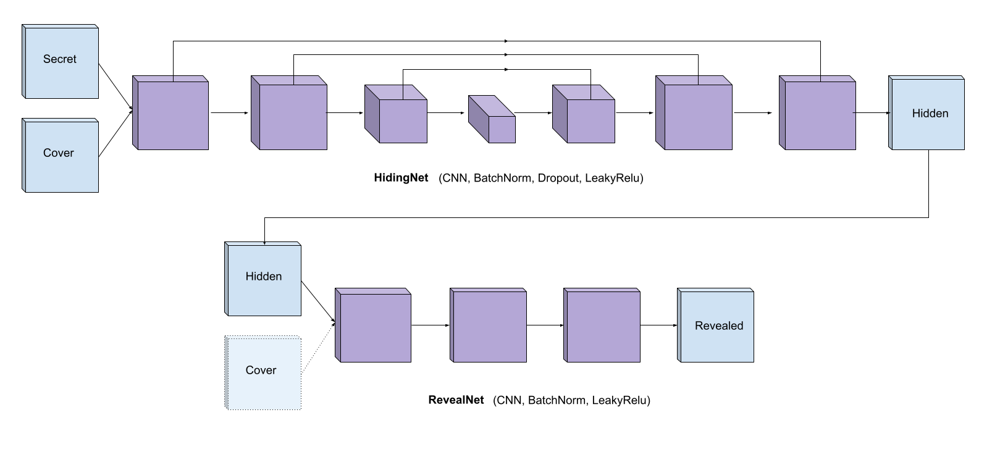

Hiding Images with Deep Steganography
=====================================

Steganography
-------------
[Steganography](https://en.wikipedia.org/wiki/Steganography) is the practice of concealing a file, message, image, or video within another file, message, image, or video.

Problem
-------
Hide a colorful image into another colorful image with minumum change, then reveal the secret image as much as possible

Model
-----

[HidingNet](HidingNet.py) consists of hidingnet and revealing net.  
Hidingnet contains skip connections to preserve spatial features.
Revealnet consists of basic CNN layers and BatchNorm layers.

Dataset
-------
[MS COCO 2017](https://cocodataset.org/#download) is used.  
> I used testset(41K) for training and valset(5K) for testing.
> Original trainset(118K) should be preffered for training to get better performance. 

Should be placed in `data/raw/coco-test2017` & `data/raw/coco-val2017`  

Requirements
------------
Pytorch, Numpy, Pillow, skimage

Results
-------

### Test Results
**Rows correspond to Secret, Cover, Hidden and Revealed Images in order**

#### 1) Hidden-Cover

**Rows correspond to Hidden, Cover, Hidden-Cover, 10\*(Hidden-Cover) in order**

#### 2) Hidden-Secret
**Rows correspond to Hidden, Secret, Hidden-Secret, 10\*(Hidden-Secret) in order**

#### 3) Reveal-Secret
**Rows correspond to Reveal, Secret, Reveal-Secret, 10\*(Reveal-Cover) in order**

### Training Results

**Rows correspond to: Secret, Cover, Hidden and Revealed Images in order**

  

  Before Training

  

---   

  

  Step 1000

  

---   

  

  Step 20000

---   

  

  After Training

  

References
----------
[1] Baluja, Shumeet. "Hiding images in plain sight: Deep steganography." Advances in Neural Information Processing Systems. 2017.

